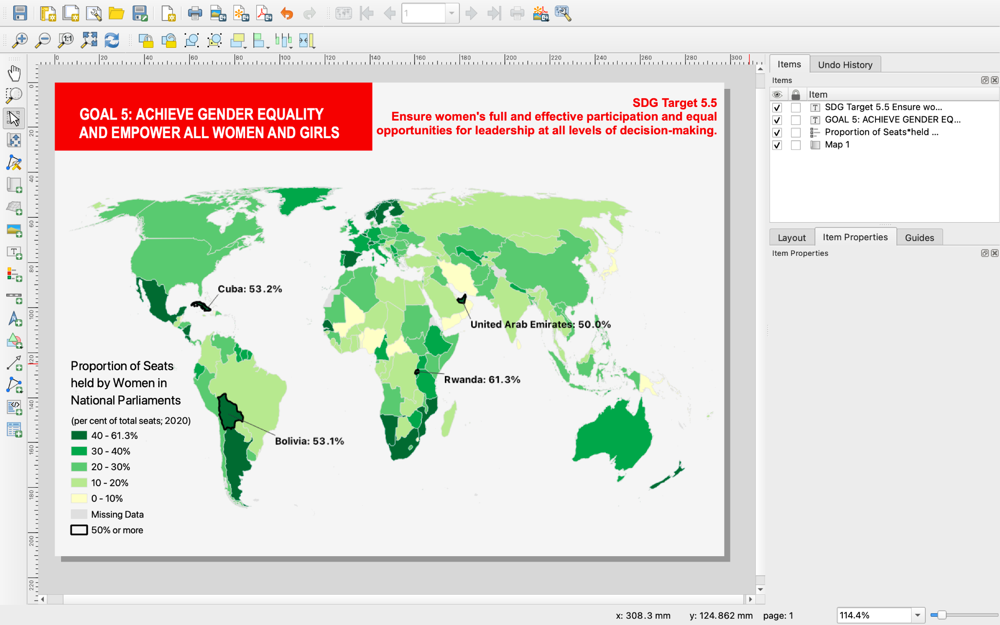
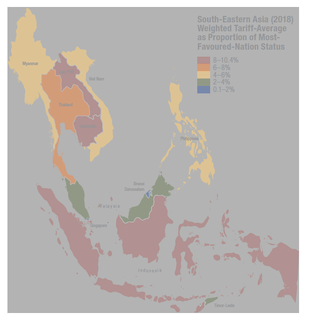

**Tutorial 1.13: Advanced Layout Styling**

**Summary**

**Tutorial 1.13** demonstrates how to change a few of the existing elements to be more stylistically appealing (*Figure 1.13-1*). This lesson will match the map as it appears in the *Mapping for a Sustainable World* book, but feel free to continue experimenting on your own.

*Figure 1.13-1: Choropleth map layout with additional stylistic features.*

**Changing the Background**

Change the background. Right click on the page and click *Page Properties…* and change the *Background* to very light grey. Click the arrow next to this menu to change the colour. Use a grey lighter than the light grey you used to colour the "Missing Data" countries.

Your map has a white background. Click on the map. Under the *Item Properties* for *Map 1* scroll down to *Background* and uncheck the box.

**Changing the Text**

Add a red background to the title. Click on the title. Under the *Item Properties*** **of the *Label* scroll down to *Appearance* and use the following settings:

> * Font color: white

> * Horizontal margin: 3.00 mm

> * Vertical margin: 3.00 mm

> * Horizontal alignment: Left

Change the font by right clicking on *Font*** **and then *Configure Format...* Select a font that you like and make it *Bold*. To match the *Mapping for a Sustainable World* figure, find a font with a *Narrow* or *Condensed* option.

Scroll down to *Background* and expand the menu. Change the colour to bright red.

Adjust the size of the textbox so there is an even border around the entire title.

Note that the use of red and green together in a map can cause issues for people who are red/green colourblind (*Figure 1.13-2, *see **Section 4.2**). Never use red and green together to symbolize *data*. However, in this map data is green, and red is only used as a stylistic element for the title.

*Figure 1.13-2: Improper colour scheme for visually impaired individuals, book Figure 4.2-1.*

Style the subtitle. Click on the subtitle. Under the *Item Properties* of the *Label* scroll down to *Appearance*. Change the *Font colour*** **to the same bright red you used for the background of the title. Change the *Horizontal alignment* to right. Use the same font as above and make it Bold.

**Additional Design Considerations**

At this point, your map is looking a lot like the one in *Mapping for a Sustainable World*! You could also add the other supplementary text by using *Add Label* again. Other, more advanced features like the addition of a drop shadow (the shadow behind the countries) and the addition of graphs (*Figure 1.13-3, *see **Section 3.10**) require additional software, such as Inkscape or Adobe Illustrator.

*Figure 1.13-3: Non-map graphics, book Figure 3.10-1.*

You have now completed the choropleth map tutorial. If you would like to learn how to make a proportional symbol map (a different thematic map), proceed to **Tutorial 2.1**: Overview and Setup.

