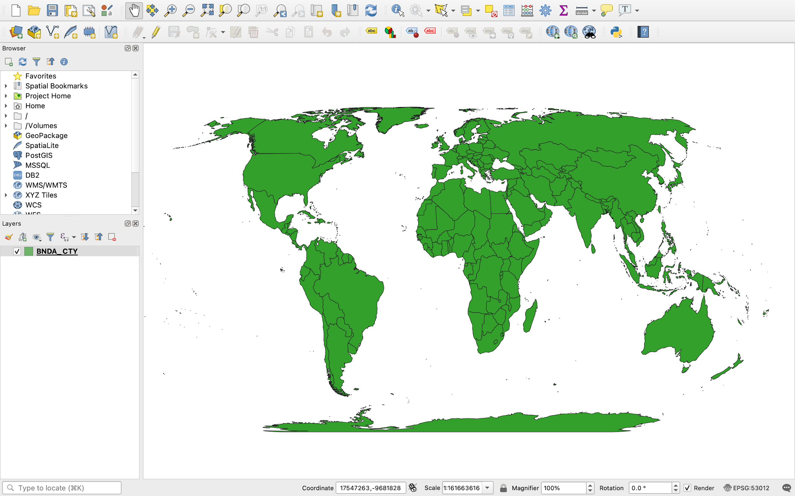

**Tutorial 1.5: Creating a Project and Setting the Projection**

**Summary**

**Tutorial 1.5** demonstrates how to add locational data to QGIS and to project the map (*Figure 1.5-1)*.

*Figure 1.5-1: The map file projected in Eckert IV*.

**Creating a Project**

Open QGIS. Click *New Empty Project*.

In the Menu bar (top of the screen) click *Layer→Add Layer→Add Vector Layer*.

The *Data Source Manager | Vector* window will open. 

Click the icon with three dots () toward the right of the screen. Navigate to your *SDG_choropleth_tutorial* folder. Select *UNMAP NAME.shp* and then click *Add*.

**Setting the Shapefile Projection**

Close this window. There is a world map on the screen. This map is not ***projected*** (*Figure 1.5-2*). It currently uses a geographic coordinate system to tell the software how to read the file, but this is not a projected coordinate system.

> ***Projection***: the process of transferring geospatial data from a three-dimensional model of the Earth to a two-dimensional or "flat" map (see **Section 2.4**)

*Figure 1.5-2: World map projections, book Figure 2.4-2.*

Since you are making a choropleth map, which relies on area, you want to reduce distortion of area. However, this means you will distort shape. Use the Eckert IV projection, which is a common ***equal-area projection*** for world maps.

> ***Equal-area projection***: a projection that preserves the relative areas of polygon features, often heavily distorting shape as a result

To change the projection, right click on *UNMAP NAME* in the *Layers* panel (bottom left of the screen). Click *Export→Save features as…*

Click the icon with three dots. Navigate to your *SDG_Choropleth_Tutorial* folder. Name the file something memorable like *reprojected_map_eckert_iv*.*shp* and click *Save*.

Under CRS, change the projection. Click the globe () and search for the Eckert IV projection. Select *Sphere_Eckert_IV* which has the EPSG code 53012.

Click *OK*. Confirm *Add saved file to map* is checked and click *OK*.

**Setting the Project Projection**

After this step, the map does not look different. Your file is saved in the Eckert IV projection, but the project is not.

Before the next step, note that QGIS will sometimes display an error at this stage. In the *Layers* panel, a Question Mark () may appear next to the file name. If you have this error, click the Question Mark. Select the *Sphere_Eckert_IV* projection again and click *OK*.

In the Menu bar go to *Project→Properties…* and click the *CRS* tab. The Eckert IV projection should appear in *Recently Used Coordinate Reference Systems*. Select *Sphere_Eckert_IV* and click *OK*.

In the Layers panel, right click on *UNMAP NAME* and click *Remove Layer*, then click *OK*. 

Because you added a reprojected shapefile, you no longer need the original *name* shapefile. 

Save your project. In the Menu bar, go to *Project→Save as…* and name your project something memorable like *SDG_choropleth_tutorial_map*. Save it in the project folder.

**Setting the Scale**

At this stage it is important to think about ***scale***. The polygons representing location can have generalized or complex linework depending on the scale (*Figure 1.5-3*). The UN shapefile is already simplified for your purposes, so you did not have to do anything for this step.

> ***Cartographic scale***: the ratio between a distance represented on a map and the corresponding distance in the real world (see **Section 2.6**)

*Figure 1.5-3: Simplified linework, book Figure 2.7-1.*

Now you have your location data projected properly. Proceed to **Tutorial 1.6**: Adding and Joining Attribute Data.

