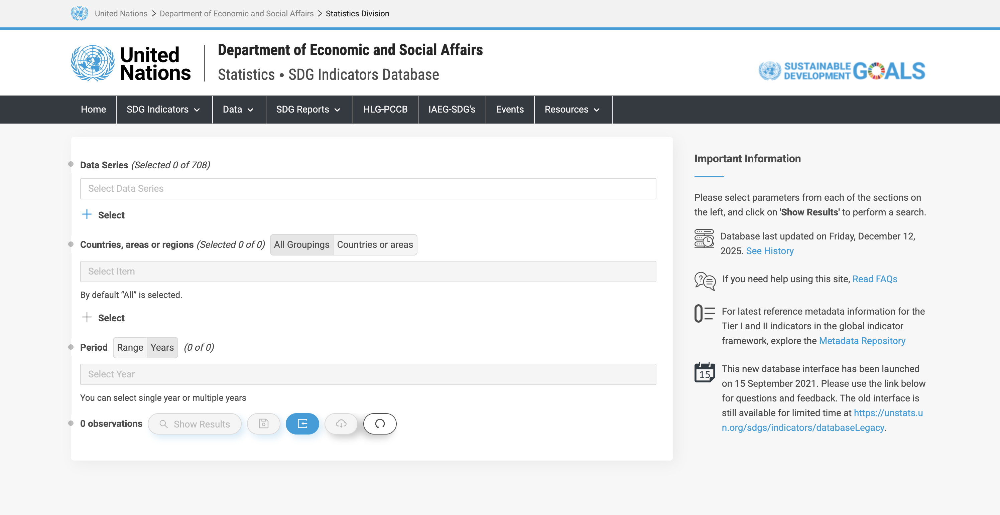
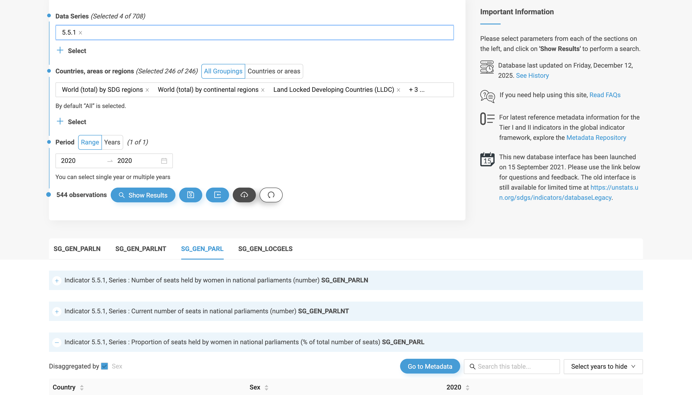

## Tutorial 1.3: Downloading Location and Attribute Data

**Summary**

**Tutorial 1.3** demonstrates how to download ***attribute*** and ***location data*** to make your choropleth map (*Figure 1.3-1)*. You will download two files:

1. Shapefile of countries in the world
2. Proportion of seats held by women in national parliaments

Maps often compile data from many sources, often in incomplete or messy forms. It is your job to "clean up" the data so that it can be used harmoniously in a map.

> ***Location***: the where of geospatial data (see **Section 1.2** from the *[Mapping for a Sustainable World](https://digitallibrary.un.org/record/3898826)* book)

> ***Attribute***: the what or who of geospatial data (see **Section 1.3** from the *[Mapping for a Sustainable World](https://digitallibrary.un.org/record/3898826)* book)

###### Figure 1.3-1: SDG data from the UN website.

**Downloading Location Data**

First, create a folder to store the project and data. In your preferred location on your computer, create a folder called *SDG_choropleth_tutorial*.

This tutorial demonstrates how to download a shapefile directly from the UN. If, for any reason, the UN data is not working or not available, you may download it [here](https://github.com/uwcartlab/Vienna-DC-2025/tree/main/Data/Spatial-Data).

Download the shapefile from the [UN Geospatial Hub](https://geoportal.un.org/arcgis/apps/sites/#/geohub/datasets/f86966528d5943efbdb83fd521dc0943/about) by clicking the "Download" button. At its simplest, geospatial data are stored as a shapefile (extension .shp), a common format created by Esri recognized by most mapping software. actually are a combination of many files when viewed in a file folder, and thus typically are shared as .zip. 

Save the file in your project folder. Unzip the file to access its contents and name it *UN_Countries.shp*. If you do not have a program that can zip and unzip (sometimes called "compress" and "uncompress") zip files, download the open source *[7zip](https://www.7-zip.org/download.html)* program to do so. We will open the files in [**Tutorial 1.5**](/1_Choropleth/1.05_Project_and_Save.md).

**Downloading Attribute Data**

Download the data for SDG indicator 5.5.1 from the [Statistics Division of the UN website](https://unstats.un.org/sdgs/dataportal/database). This database stores the data for all SDG indicators. 

Under *Data Series* click the plus sign next to *Select* to expand *Goal 5→Target 5.5→Indicator 5.5.1*.

Click the box next to *INDICATOR 5.5.1: Proportion of seats held by women*. Then, click "Done".

Do not select anything for *Countries, areas, or regions*.

Under *Period* click *Range* and select *2020* as both the start year and end year. This tutorial reproduces the graphics from the book and thus uses the year 2020, but you are welcome to select a more recent year.

Click *Show Results* (bottom of the page) to preview the data (Figure 1.3-2). ***Do not*** click the dark grey *Download* button. 

###### Figure 1.3-2: The necessary settings to preview the SDG data for this map.

Scroll down and expand the third result, *SG_GEN_PARL* and click *Download XLS* (bottom of the page). Save this file in your project folder.

Here, you are downloading the percentage of seats in parliament held by women, not just the number of seats held by women, which means that the data you are download already is ***normalized***.

> ***Normalization***: the conversion of absolute attributes to relative attributes to mask privacy of individual-level data and to ensure visual comparability of enumerated data across enumeration units of varying arrangement, shape, and size (see **Section 1.4** from the *[Mapping for a Sustainable World](https://digitallibrary.un.org/record/3898826)* book)

Now you have saved the necessary attribute and locational data to make your choropleth map. Proceed to [**Tutorial 1.4**: Cleaning Attribute Data](/1_Choropleth/1.04_Clean_Data.md).

