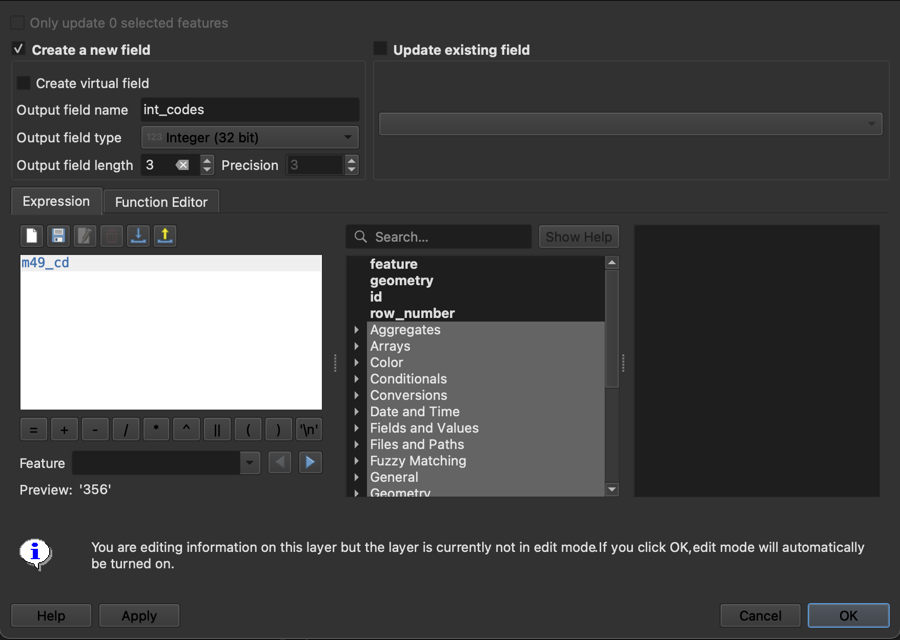

## Tutorial 1.6: Adding and Joining Attribute Data

**Summary**

**Tutorial 1.6** demonstrates how to add attribute data to the project and join layers *(Figure 1.6-1)*.

###### Figure 1.6-1: Attribute table for joined layers.

**Adding CSV Files**

In the Menu bar, click *Layer→Add Layer→Add Delimited Text Layer*. Click the three dots and add *unwp.csv* to the project. Do not change any settings. Click *Add* and close the window.

Check if the data imported properly. Right click *unwp* in the *Layers* panel and click *Open Attribute Table*. View the data to make sure you do not see any issues. Close the tab.

Since this is a CSV file, nothing new appears on the screen. It only contains attribute data, not location data.

**Creating an Integer Column in the Shapefile Attribute Table**

Right click on *UN_Countries_Simplified* and click *Open Attribute Table*. The attribute table contains all of the additional data for the shapefile, beyond the geographic location.

In the next step you will join the CSV file to the shapefile. However, they need to have columns that are the same to make the join. The field *m49_cd* (the third field) is almost the same as a field in the CSV file, with a unique number for each country. However, the shapefile encodes all of these numbers as three digits, meaning some of the have extra zeros at the beginning of the number, while the CSV file does not have these extra zeros.

To remove the zeros, you will make a new column that is an integer instead of the current "string" field type.

Click the yellow pencil 
at the top left of the attribute table to *Enter editing mode*.

After you enter editing mode, click the abacus  to *Open field calculator*.

In the field calculator, ensure *Create a new field* is checked.

In *Output field name* type *int_codes*.

Ensure the *Output field type* is *Integer (32 bit)*.

The *Output field length* can be *3* since no country codes are larger than 3.

In the *Expression*, type *m49_cd* which is the name of the field that is currently a string. This is the only think you need to type here. This expression is relatively straightforward, but you may need to use more complex expressions in future maps. Your screen should match *Figure 1.6-2*.

###### Figure 1.6-2: Field calculator expression to create an integer layer.

Click *OK* to create the field. The new field will be the last field (you will need to scroll to see it). This new field does not have the unnecessary zeros.

Click the pencil again to *Toggle editing mode* again (this time you are leaving editing mode). When a window pops up asking if you want to save your changes, click *Save*.

**Joining SHP and CSV Files**

Right click on *UN_Countries_Simplified* in the *Layers* panel and click *Properties*. Click the *Joins* tab.

Click the green plus sign (). Join the data in this file to your CSV *unwp*.

The *Join layer* should be your *unwp* file. 

Find the field that is the same between the two files. The computer will only make a join when the data in the two fields is exactly the same. Use the country codes to join the data.

The *Join field* is the header of a field in the CSV file. The *Join field* is called *GeoAreaCode* and the *Target field* is called *int_codes*. 

Click *OK* and then click *OK* again.

Open the Attribute Table for *UN_Countries_Simplified*. View the data to see if it has been joined correctly. Scroll to the middle to find the field *unwp_2020*. If some rows are NULL, that is okay. These are usually countries that do not have data. If all countries are NULL, then there was an issue with your *Join*. 

You may notice that there are a number of countries with data that did not join properly. This is because the data is not reported by the UN. Even since these tutorials were first developed in 2021, some data has since been removed from the UN website. Your map may not always look exactly the same as the images in these tutorials.

**Creating a Permanent SHP Join**

Once you are satisfied with your join, you need to make the join permanent in a new file. Save *UN_Countries_Simplified* as a new shapefile. Right click *UN_Countries_Simplified* in the *Layers* panel and click *Export→Save features as…*

Click the three dots and name your file *UN_wom_par_eiv.shp*. Confirm *Add saved file to the map* is selected and click *OK*. 

Remove all layers except for *UN_wom_par_eiv*. Right click each file and click *Remove Layer…* and then *OK*. 

Now you have added all the necessary layers and joined them together. Save and proceed to [**Tutorial 1.7**: Classify Data](/1_Choropleth/1.07_Classify_Data.md).

