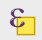

## Tutorial 1.9: Visual Accenting

**Summary**

**Tutorial 1.9** demonstrates how to add bold borders to make important data stand out *(Figure 1.9-1)*. The map is looking pretty good right now. If you wanted, you could add a title and legend and be done!

###### Figure 1.9-1: Visual accenting for countries with greater than 50.0% women in parliament.

**Highlighting High Values**

Before working on the layout, make a few stylistic edits (see **Section 2.14**). You have already changed the outlines of the countries, which is a good start to making the map easier to read.

Next, highlight (see **Section 2.13**) the countries where more than 50.0% of parliament is female.

Right click *UN_wom_par_eiv* in the *Layers* panel and click *Attribute Table*. Click on the icon of an E over a yellow square () which allows you to *Select features using an expression*. 

Fill in the *Expression*. On the right panel, expand *Fields and Values* and double click on *Percent* to insert it into the expression. Then type *>= 50*and click *Select Features*. Click *Close*.

Look at the attribute table. Four countries should be selected. To see them, scroll over to the *Percent* column and sort the column by values. Sort by clicking the column heading (the word *Percent*). 

Close the attribute table. The countries will remain selected. Export these countries as a new layer. Right click on *UN_wom_par_eiv* and click *Export→Save Selected Features As…*

Click the three dots. In your project folder name the layer *UN_wom_par_fiftyplus.shp* and click *Save*. Ensure the *Format* is *ESRI Shapefile* and click *OK*.

Deselect features from *UN_wom_par_eiv*. At the top of the screen *Deselect Features from All Layers*. by clicking the icon of the yellow square next to the red cancel sign ().

Move *UN_wom_par_fiftyplus* above *UN_wom_par_eiv* in the *Layers* panel to see it.

Right click *UN_wom_par_fiftyplus* and go to *Properties*. In the *Symbology* tab under *Fill* click *Simple Fill*. Click on the arrow on the right side of *Fill color* and click *Transparent Fill*. Now you see the fill below which represents the attribute data.

These countries should stand out, or "rise to figure" on the ***visual hierarchy*** (see **Section 2.13**). Under *Simple Fill* change the *Stroke color* to very dark grey. Don't go all the way to black; when designing for the web, dark grey is preferred. 

> ***Visual hierarchy***: the order that map elements are perceived visually (see **Section 2.13**)

Change the *Stroke width* to *0.75*, which is thicker than the other borders. Now the countries where the parliamentary makeup is more than 50% female are starting to stand out!

Now you have added bold borders to the countries with the highest values. Save and proceed to [**Tutorial 1.10**: Labeling and Leader Lines](/1_Choropleth/1.10_Labels.md).

