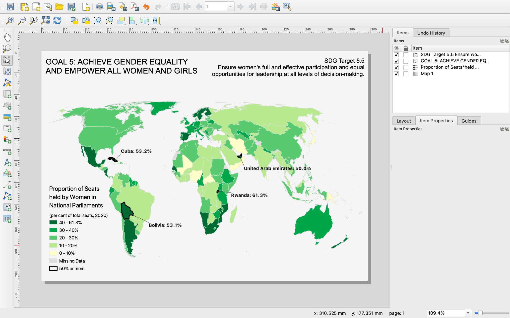

## Tutorial 1.11: Adding Elements to Layout View

**Summary**

**Tutorial 1.11** demonstrates how to add a few map features in the *Print Layout (Figure 1.11-1)*. For more on layout and visual hierarchy, see **Section 2.13**.

###### Figure 1.11-1: Choropleth map layout.

**Creating a Print Layout**

Click *Project→New Print Layout…* and name your layout *UN_wom_par_final*, then click *OK*.

You are presented with a blank page. First, add the map. At the top of the screen, go to *Add Item→Add Map*. Click and hold to draw a rectangle that is almost the size of the page.

The map is at a very small scale (large worldwide extent). On the right side of the screen, view the current *Scale* (*Figure 1.11-2*, see **Section 2.6**). It is common practice to use an even number. Use *105000000* (that's six zeros after the 5). You already considered scale in [**Tutorial 1.5**](/1_Choropleth/1.05_Project_and_Save.md), so the linework is properly generalized.

###### Figure 1.11-2: Geographic scale, book Figure 2.6-2.

Make sure no countries are cut off. If needed, extend the *Map Item* all the way to the left and the right of the page. Use *Move item content* () on the left side of the screen to center the map and avoid cutting off Alaska or Pacific Islands.

**Adding a Legend to the Print Layout**

Next, add a ***legend*** (*Figure 1.11-3*). Go to *Add Item→Add Legend*. Draw a small box on the left side of the page.

> ***Legend***: a description of each kind of symbol included in the map (see **Section 3.6**)

###### Figure 1.11-3: Creating a legend, book Figure 3.6-2.

At first, the format of the legend is not easy to read. In the *Item Properties* of the *Legend*, under *Main Properties* change the *Title* to *Proportion of Seats\*held by Women in\*National Parliaments*. The * symbol is necessary. 

In *Wrap text on* type the * symbol, which allows the long legend title to span multiple lines.

Under *Legend Items*, turn off *Auto Update* by unchecking the box. Reorder the legend so *UN_wom_par_fiftyplus* is below *UN_wom_par_eiv*.

Rename *UN_wom_par_eiv* to *(per cent of total seats; 2020)* by double clicking the name and typing in the box. Click *OK* to save.

For each of the five numeric classes, add a *%* sign after the second number in each class.

Rename the blank layer *Missing Data*.

Rename *UN_wom_par_fiftyplus* to *50% or more*.

Scroll down to *Background* and uncheck the box next to it. The legend fits well on the left side of the map, except for the white background. 

Experiment with the font type, size, and colour to design the map based on your preferences.

The legend and the Bolivia label may overlap, depending on where you placed the label. Your *Layout* saves automatically. Close it and adjust the Bolivia label in the map view. 

To open the layout again, go to *Project→Layouts→UN_wom_par_final*.

**Adding Text to the Print Layout**

Add the title, click *Add Item→Add Label*. Draw a small rectangle in the top left of the 

page. In *Item Properties* under *Label*, type in the text box under *Main Properties*.

Using Caps Lock, type *GOAL 5: ACHIEVE GENDER EQUALITY AND EMPOWER ALL WOMEN AND GIRLS*.

Scroll down to *Appearance* and click the arrow on the right side of *Font*. Change the *Font size (pt)* to *20.0*. 

Drag the right side of the textbox toward the left of the page until the title is on two lines. Unlike the legend, text can be pushed onto two lines without adding the * symbol to split it. If some of the text disappears, drag the bottom of the textbox down.

Add a subtitle. Click *Add Item→Add Label.* Type *SDG Target 5.5 Ensure women's full and effective participation and equal opportunities for leadership at all levels of decision-making.* in the text box. Press enter after 5.5 to place it on a separate line.

Change the font size of the subtitle to *15.0* and condense the box so the text is on a total of three lines (one is the "SDG Target 5.5" line). 

At this point, you have a complete map! If you were making a map for another purpose, you could use the same *Add Label* feature to add a citation of your data sources, the name of the agency producing the map, or other important information.

[**Tutorial 1.12**](/1_Choropleth/1.12_Save.md) will cover how to save your map, while [**Tutorial 1.13**](/1_Choropleth/1.13_Advanced_Layout.md) will cover additional stylistic features. Feel free to add the additional stylistic features before saving.

You have now begun to add features to the print layout. Save and proceed to [**Tutorial 1.12**: Exporting the Map](/1_Choropleth/1.12_Save.md).

