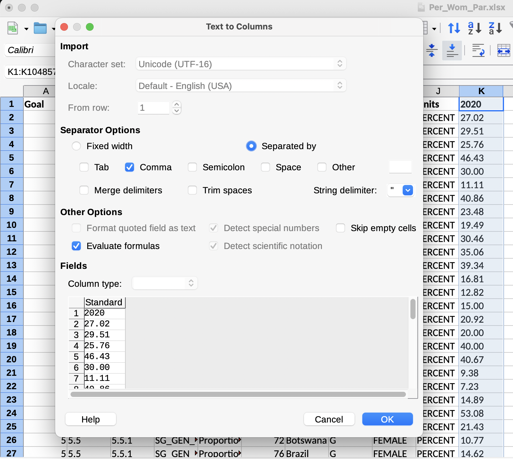

## Tutorial 1.4: Cleaning Attribute Data

**Summary**

**Tutorial 1.4** demonstrates how to "clean" the downloaded datasets. In this case, cleaning refers to preparatory steps needed to edit datasets collected from multiple sources so that they can be combined in mapping software. Data cleaning also can include checking for errors, eliminating unnecessary fields, and so on.

**Renaming Datasets**

Open *SG_GEN_PARL.xlsx* (percentage of women in parliament).

Rename these files to something easier to understand. Click *File,* then *Save As...* for *SG_GEN_PARL.xlsx* and name it *Per_Wom_Par.xlsx (Figure 1.4-1)*.

###### Figure 1.4-1: Excel spreadsheet of edited data for choropleth map.

You created copies of the original files because you are going to edit the new files. Preserving the original file for future use is good data management practice.

**Converting to Qualitative Numbers**

Select the entire *2020* column in *Per_Wom_Par.xlsx* by clicking the header. A yellow triangle with a *!* pops up. The data is *Number Stored as Text*, which is interpreted by mapping software as nominal-level or qualitative data. However, choropleth maps require ordinal-level or ***quantitative*** (***interval*** or ***ratio***) data.

> ***Quantitative data***: interval- and ratio-level data together (see **Section 1.4**)

> ***Ratio level data***: attribute data that is quantitative values with a fixed zero

> ***Interval-level data***: attribute data that is quantitative, but the zero value is arbitrary and, thus, limits estimation of relative magnitudes

Click *Convert to Number* to enable QGIS to interpret the attribute as quantitative. The attributes also need to be converted to numbers for other ***data transformations***, such as normalization and classification.

> ***Data transformation***: statistical conversion of an attribute (see **Section 1.7**)

**Combining Attribute Datasets**

For this map you only downloaded data from 2020. However, for future maps you may want to download all years if you revise your plan and decide to map temporal data (*Figure 1.4-2*, see **Section 3.9**).

###### Figure 1.4-2: Temporal data visualization, book Figure 3.9-1.

**Converting to CSV**

Save the file again using your project folder. QGIS will not read the Excel file format, so save the data as a Comma Separated Value (CSV) file. Click *File→Save as…* and name the file *unwp.csv*. Switch the File Format to *CSV UTF-8 (Comma delimited) (.csv)* and click *Save*. 

Because this document has multiple spreadsheets, you will receive a minor error message. You can only save one spreadsheet at a time as a .csv file. You only need the sheet you have been working on, so click *OK*.

Now that your data is cleaned, proceed to [**Tutorial 1.5**: Creating a Project and Setting the Projection](/1_Choropleth/1.5_Project_and_Save.md).

