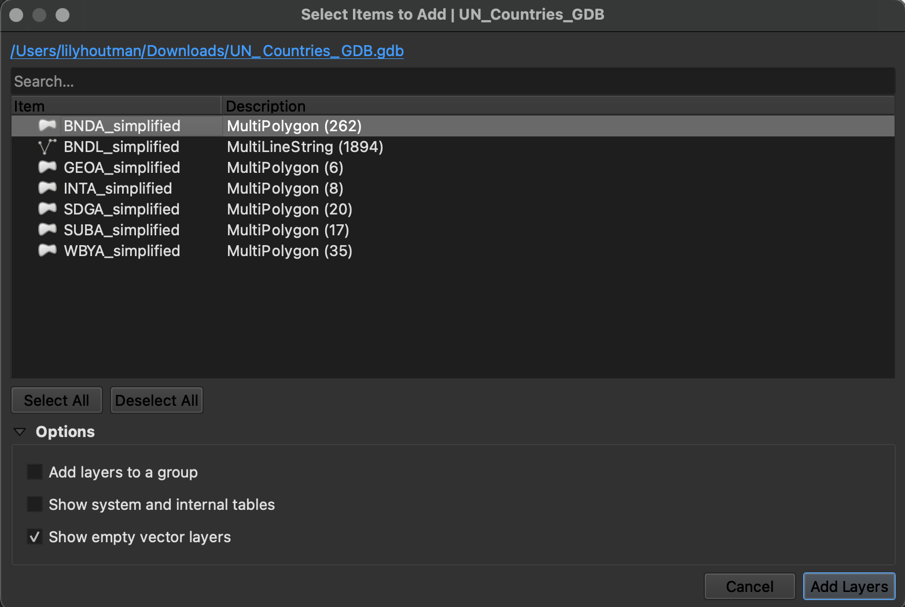
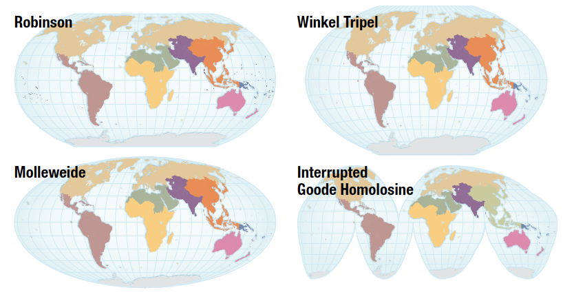
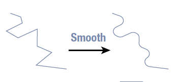

## Tutorial 1.5: Creating a Project and Setting the Projection

**Summary**

**Tutorial 1.5** demonstrates how to add locational data to QGIS and to project the map (*Figure 1.5-1*).

###### Figure 1.5-1: The map file projected in Eckert IV.

**Creating a Project**

Open QGIS. Click *New Empty Project*.

If you are using the **Geodatabase**, follow these instructions:

In the Menu bar (top of the screen) click *Layer→Add Layer→Add Vector Layer*.

The *Data Source Manager | Vector* window will open. 

Set the *Source Type* as *Directory*.

Under *Source*, change the *Type* to *OpenFileGDB*.

Click the icon with three dots () toward the right of the screen. Navigate to your *SDG_choropleth_tutorial* folder. Select the *UN_Countries_GDB.gdb* folder and then click *Add*.

###### Figure 1.5-2: When opening the Geodatabase, only select the *BNDA_simplified* file.

You will be presented with multiple shapefiles to open. The only file that you need to open is *BNDA_simplified* (*Figure 1.5-1*). However, you may also wish to open *WBYA_simplified* which includes major large lakes in the world, as a stylistic element.

Select only the layer(s) you need and then click *Add Layers*. After that, click *Close*.

If you are using the **cleaned shapefile**, follow these instructions:

In the Menu bar (top of the screen) click *Layer→Add Layer→Add Vector Layer*.

The *Data Source Manager | Vector* window will open. 

Click the icon with three dots () toward the right of the screen. Navigate to your *SDG_choropleth_tutorial* folder. Select *UN_Countries_Simplified.shp* and then click *Add*.

**Setting the Shapefile Projection**

Close this window. There is a world map on the screen. This map is already ***projected*** (*Figure 1.5-3*) because you downloaded it from the UN. However, some other sources that you may download a shapefile from, like [Natural Earth](https://www.naturalearthdata.com/), provide files that use only a geographic coordinate system to tell the software how to read the file, but this is not a projected coordinate system.

> ***Projection***: the process of transferring geospatial data from a three-dimensional model of the Earth to a two-dimensional or "flat" map (see **Section 2.4**)

###### Figure 1.5-3: World map projections, book Figure 2.4-2.

Since you are making a choropleth map, which relies on area, you want to reduce distortion of area. However, this means you will distort shape. The Eckert IV projection, a common ***equal-area projection*** for world maps, is a good choice for choropleth maps, and it is what the UN file is projected in.

> ***Equal-area projection***: a projection that preserves the relative areas of polygon features, often heavily distorting shape as a result

**Saving the Project**

Save your project. In the Menu bar, go to *Project→Save as…* and name your project something memorable like *SDG_choropleth_tutorial_map*. Save it in the project folder.

**Setting the Scale**

At this stage it is important to think about ***scale***. The polygons representing location can have generalized or complex linework depending on the scale (*Figure 1.5-4*). The UN shapefile is already simplified for your purposes, so you did not have to do anything for this step.

> ***Cartographic scale***: the ratio between a distance represented on a map and the corresponding distance in the real world (see **Section 2.6**)

###### Figure 1.5-4: Simplified linework, book Figure 2.7-1.

Now you have your location data projected properly. Proceed to [**Tutorial 1.6**: Adding and Joining Attribute Data](/1_Choropleth/1.6_Add_Data.md).

