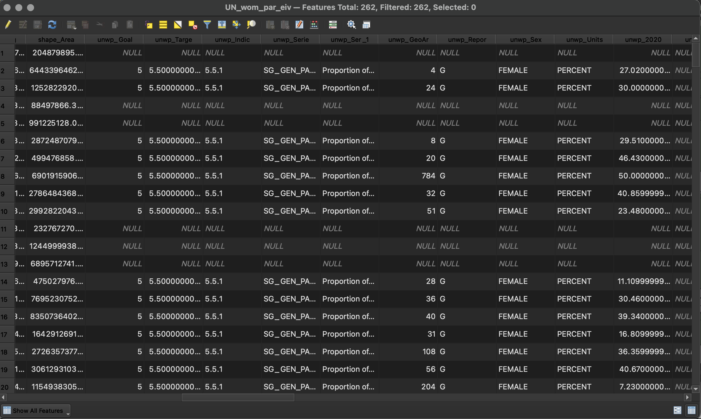

## Tutorial 1.6: Adding and Joining Attribute Data

**Summary**

**Tutorial 1.6** demonstrates how to add attribute data to the project and join layers *(Figure 1.6-1)*.

###### Figure 1.6-1: Attribute table for joined layers.

**Adding CSV Files**

In the Menu bar, click *Layer→Add Layer→Add Delimited Text Layer*. Click the three dots and add *unwp.csv* to the project. Do not change any settings. Click *Add* and close the window.

Check if the data imported properly. Right click *unwp* in the *Layers* panel and click *Open Attribute Table*. View the data to make sure you do not see any issues. Close the tab.

Repeat this process to add *cc.csv* to the project.

Since these are both CSV files, nothing new appears on the screen. They only contain attribute data, not location data.

**Joining CSV Files**

Right click on *unwp* in the *Layers* panel and click *Properties*. Click the *Joins* tab.

Click the green plus sign (). Join the data in this file to the *cc* file.

The *Join layer* should be your *cc* file. 

Find a field that is the same between the two files. The computer will only make a join when the data in the two fields is exactly the same. Use Country Code to join the data.

The *Join field* is the header of a field in the CSV file. The *Join field* is called *Country Code* and the *Target field* is called *GeoAreaCode*. 

Click *OK* and then click *OK* again.

Open the Attribute Table for *unwp*. View the data to see if it has been joined correctly. Scroll all the way to the right side. If some rows are NULL, that is okay. These are usually countries that there is no data for. If all countries are NULL, then there was an issue with your *Join*. If there is an issue, remove the join and try again.

Save *unwp* as a new file. You have only created a temporary join. Right click *unwp* in the *Layers* panel and click *Export→Save features as…*

Click the three dots and name your file *unwpcc.csv*. Change the format to *Comma Separated Value [CSV]*. Confirm *Add new file to the map* is selected and click *OK*. You can remove the other two CSV files from the document. 

**Joining SHP and CSV Files**

Make one more join. Join *unwpcc* with *reprojected_map_eckert_iv*. 

Follow similar steps as above to join these two layers. Right click on *reprojected_map_eckert_iv* and access the *Joins* tab. The *Join layer* is *unwpcc*. The *Join field* is *country_codes_ISO3-digit Alpha* and the *Target field* is *ISO3CD*.

Save this layer as a new file to make the join permanent. Name it *UN_wom_par_eiv.shp* with the format as *ESRI Shapefile*.

Remove all layers except for *UN_wom_par_eiv*. Right click each file and click *Remove Layer…* and then *OK*. 

Now you have added all the necessary layers and joined them together. Save and proceed to [**Tutorial 1.7**: Editing the Attribute Table](/1_Choropleth/1.7_Edit_Attribute_table_Map_Algebra.md).

