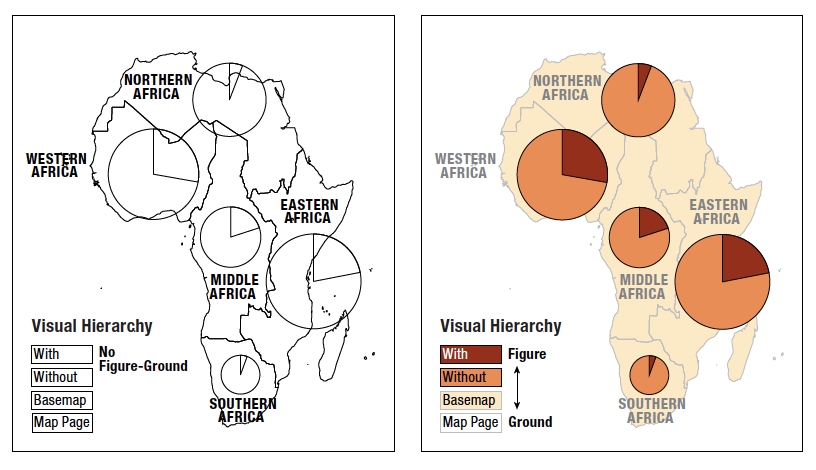
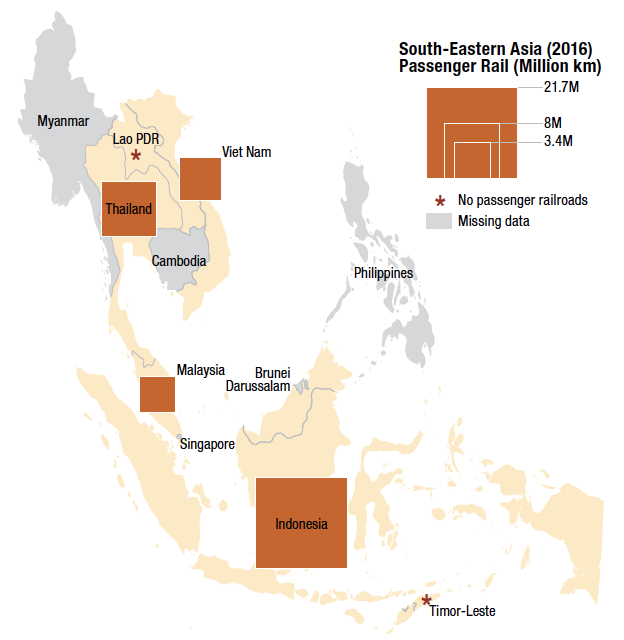

## Tutorial 1.8: Classifying Attribute Data

**Summary**

**Tutorial 1.8** demonstrates how to ***classify*** data to make an appropriate choropleth map, which uses a colour ramp to display differences in data *(Figure 1.8-1)*. 

> ***Classification***: the process of organizing map features into groups to improve legibility in the representation (see **Section 1.9**)

###### Figure 1.8-1: Choropleth map based on classified data.

**Styling the Map**

Make one ***stylistic*** adjustment before classifying the data. 

> ***Visual style***: a cohesive set of design characteristics and qualities that reinforce the purpose of the map (see **Section 2.14**)

Right click *UN_wom_par_eiv* in the *Layers* panel and click *Properties*. Open the *Symbology* tab.

Below *Fill* click *Simple fill* (toward the top of the page). Change the *Stroke colour* to light grey by clicking the arrow on the right side. Click *Choose colour* and drag the circle to a light grey part of the colour triangle. Click *Apply*.

Move the *Layer Properties* window to see that the dark black borders on the map have changed to light grey, reducing their presence on the visual hierarchy (*Figure 1.8-2*, see **Section 2.13**).

###### Figure 1.8-2: Visual hierarchy, book Figure 2.13-2.

**Setting the Colour Ramp**

Change *Single symbol* to *Graduated* at the top of the screen.

Under *Value* select *Percent*.

Select the colour ramp (*Figure 1.8-3*, see **Section 2.10**). Click the arrow on the right side of the *Colour ramp*. Then click *Create New Colour Ramp…* and change the *Colour ramp type* to *Catalog: ColorBrewer*. Click *OK*. 

###### Figure 1.8-3: Dimensions of colour, book Figure 2.10-1.

Change the *Scheme name* to *YlGn* and click *OK*. This is a ***sequential colour scheme***.

> ***Colour scheme***: the set of colour symbols and their logic for representing attributes in maps and diagrams (see **Section 1.9**)

> ***Sequential colour scheme***: a colour scheme with an apparent increase from low-to-high

**Understanding the Data Distribution**

Click the *Histogram* tab and then click *Load Values* to see how the data is distributed *(Figure 1.8-4)*. Viewing the ***histogram*** is a good idea to help determine how to classify your data.

> ***Histogram***: a univariate diagram that bins numerical data into mutually exclusive and exhaustive classes (see **Section 3.11**)

###### Figure 1.8-4: Histogram of the attribute data.

Return to the *Classes* tab. At the bottom of the screen, the default *Mode* is *Equal Counts (Quantile)* and the default *Classes* is *5*. Leave these as they are and click *Classify*. Then click *Apply*.

Move the *Layer Properties* window to the side so you can see the map.

Change the *Mode*. Switch from *Equal Counts* to *Equal Interval* and click *Apply* again. Watch how the map changes.

Repeat this process for *Natural Breaks (Jenks)* and *Pretty Breaks*. You can also experiment with changing the number of *Classes*.

By trying these different ***class breaks***, you can see how easy it is to make many different arguments with the same data!

> ***Class break***: a division point between classes within a classification scheme (see **Section 1.9**)

Some of the classes have cleaner endings, and others have lengthy decimals. Find a balance to classify the data accurately, but also allow it to be easily read by humans.

Change the *Mode* to *Natural Breaks (Jenks)*. Use this mode as the starting place for the divisions. 

Double click the first *Value* for the first *Class*. Leave the *Lower value* as *0.000* and change the *Upper value* to *10.000*. The *Lower value* for the second *Class* changes automatically.

Repeat this process, changing the *Upper value* of the second *Class* to *20.000*, the *Upper value* of the third *Class* to *30.000*, and the *Upper value* of the fourth *Class* to *40.000*. Leave the fifth *Class* as is. Click *Apply*.

**About Missing Data**

Some countries are ***missing data*** but should still appear on the map (*Figure 1.8-5*).

> ***Missing data***: the absence of an attribute value for a particular location and year (see **Section 2.15**)

###### Figure 1.8-5: Representing missing data, book Figure 2.15-1.

Switch from *Graduated* to *Rule-based*. All of the classes you defined in the previous steps will be preserved.

Click the green plus at the bottom of the screen. Switch from *Filter* to *Else*. 

Scroll down to *Symbol*. Under *Color* of the *Fill* select a light grey, commonly used to represent No Data. Also change the *Stroke color* to light grey.

Click *OK* to add these conditions, and then click *OK* again to close the *Properties* window and apply all changes.

Now you have classified the data and applied an appropriate colour scheme. Save and proceed to [**Tutorial 1.9**: Visual Accenting](/1_Choropleth/1.9_Visual_Accenting.md).

