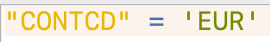

## Tutorial 2.3: Extracting European Countries and Centroids

**Summary**

**Tutorial 2.3** demonstrates how to select only European countries *(Figure 2.3-1)*.

###### Figure 2.3-1: Extracted European country points and polygons

**Selecting European Countries**

Currently, your map includes all countries. However, you will only be making a proportional symbol map of Europe.

Open the Attribute Table for *UN_inf_mor_albers* and click *Select features using an expression*. 

Type "*CONTCD" = 'EUR'* and then click *Select Features*. All of the European countries are selected. 

Save these features as *inf_mor_europe.shp*.

Keep *UN_inf_mor_albers* in the *Layers* panel, but move *inf_mor_europe* above it. 

**Converting from Polygon to Point**

Next, extract points from *inf_mor_europe*. It is currently a polygon layer, which does not allow you to make a proportional symbol map.

With *inf_mor_europe* selected, go to *Vector→Geometry Tools→Centroids* at the top of the screen.

Next to *Centroids* click the three dots, then *Save to File…* Name this layer *inf_mor_centroids.shp*. Click *Save,* then click *Run*.

Move *inf_mor_centroids* above *inf_mor_europe*.

Next, you will turn these centroids into proportional symbols.

You have now exported the European countries as a separate layer. Save and proceed to [**Tutorial 2.4**: Setting Proportional Symbols](/2_Proportional_Symbol/2.4_proportional_symbol.md).

