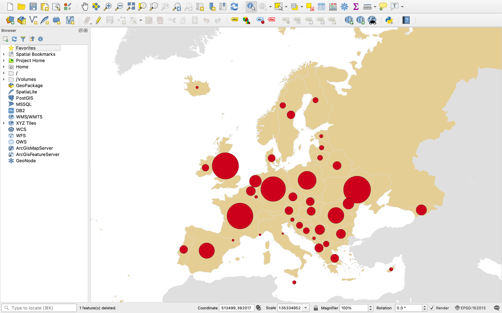

**Tutorial 2.4: Setting Proportional Symbols**

**Summary**

**Tutorial 2.4** demonstrates how to make the proportional symbols (*Figure 2.4-1)*.

*Figure 2.4-1: Centroids converted to proportional symbols*

**Setting the Proportional Symbols**

Right click on *inf_mor_centroids* and open *Properties*.

Under *Symbology* click on the *Data defined override* symbol () next to *Size*.

Click *Assistant* at the bottom of the menu. Set the *Source* as *2019*. Click the refresh button to update the *Values*.

Set the *Size from* as *2.00* and the *to* as *50.00*. Keep everything else as the default and click *OK*. 

Under *Layer Rendering* check the box next to *Control feature rendering order*. Click the icon to the right of this box () and select *2019* under the expression. Under *Asc/Desc* click *Descending* so the smallest symbols appear on top and are not hidden by the larger symbols. Click *OK*, then click *OK* again.

In the final steps, you will style the map to match the book.

You have now learned to scale the proportional symbols. Save and proceed to **Tutorial 2.5**: Adjusting Style.

