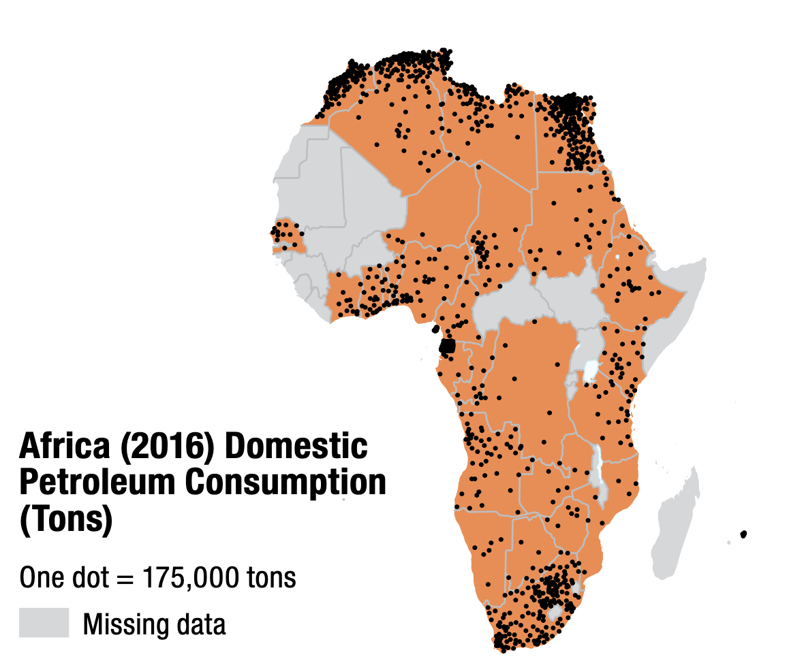

# Dot Density Tutorial: 1 - Overview and Setup 

### Summary
This tutorial describes how to create a __dot density__ map in QGIS. Dot density maps use the visual variable numerousness (a combination of arrangement and size) to depict the variation and  of a phonemona over an enumeration unit. As a visual metaphor (see _Mapping for a Sustainable World_ page 58), dot density maps allow for the visualization of phenomena that suggests discrete human, social, or physical bodies distributed over space. Therefore dot density maps are recommended for quantitative data with a smooth distribution with discrete units (i.e. number of sheep farms per Canadian province). 

This tutorial complements the other tutorials included for the workshop, including several from the [Mapping SDG Technical Supplement](https://github.com/uwcartlab/MappingSDGsTechnicalSupplement/tree/main). As such, this tutorial assumes a basic knowledge of QGIS.

###### Figure 1.1: Dot density map from page 58 of* Mapping for a Sustainable World.

### Getting Started

If this is your first time using QGIS, refer to the Mapping SDG Technical Supplement [**Tutorial 1.2**](/1_Choropleth/1.2_Download_QGIS.md) to download it.

### Downloading Location Data

Begin by creating a folder for storing your project data. 

For this tutorial, you will be using a country shapefile provided by the UN that synchronizes with SDG attribute data. The shapefile can be downloaded [here](../../Data/Spatial-Data/UN_Countries_Simplified.zip). 

After downloading, unzip the file.

### Downloading Attribute Data

For this tutorial, we are going to use a dataset which describes the number of people employed in the tourism industry. These data are perfect for a dot density map, and could be used to tell a variety of interesting visual stories.

Visit the UN stats [geoportal](https://unstats.un.org/sdgs/dataportal/database). 

For "Data Series", select "8.9.2".

For "Countries, areas, or regions", leave as the default.

For "Period", select "2022" and remove other years.

Then select "Show Results".

###### Figure 1.2: View of the UN geoportal results.

At the bottom of the page, you should now see "Indicator 8.9.2, Series : Employed persons in the tourism industries (number) ST_EMP_TRSMN" with a small plus sign the left. Select the plus sign, and the data will become visible. 

Next, download the data with the "Download XLS" button. 

In a spreadsheet editor, convert the "2022" column to numeric values, then save as "ST_EMP_TRSMN.csv".

If you have trouble downloading or converting the data, the dataset can also be accessed [here](../../Data/Attribute-Data/ST_EMP_TRSMN.csv). 

### With the data downloaded, you can move to [section 2](2_adding_joining_data.md) of the tutorial.

