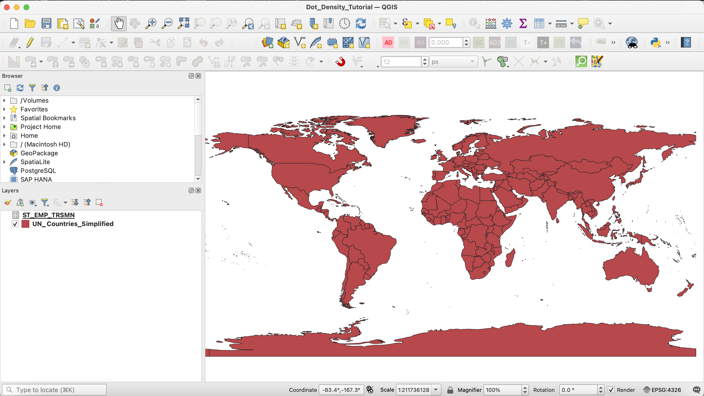
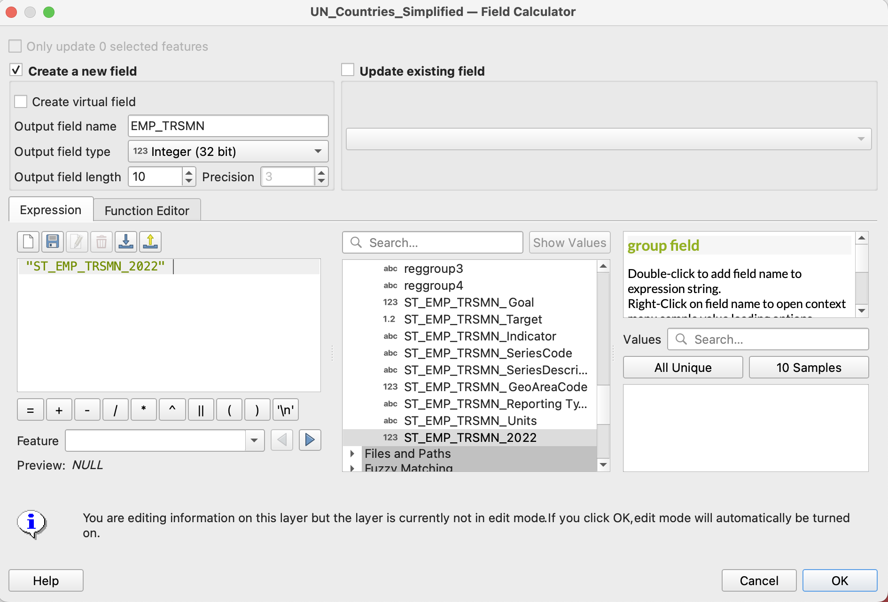
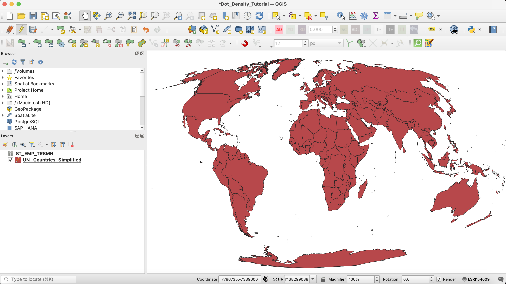

# Dot Density Tutorial: 2 - Adding/Joining/Projecting Data

### Summary
In __Tutorial 2__ you will add and join the two downloaded datasets, "UN_Countries_Simplified" shapefile, and the "ST_EMP_TRSMN.csv", then choose an appropriate projection.

### Add/Join Data
Begin by opening QGIS and adding both datasets. (Note, if you have trouble with your CSV formatting on import, try Layer>Add Layer>Add Delimited Text layer).

###### Figure 2.1: View of QGIS with both datasets added.

Join "ST_EMP_TRSMN" to "UN_Countries_Simplified", using the attributes "GeoAreaName" and "nam_en". Note that some of the features in the CSV file are for larger regional groupings of countries (i.e. Southeast Asia). 

Next, create a new field in the "UN_Countries_Simplified" shapefile, using the "2022" data from "ST_EMP_TRSMN". Set the data field name to "EMP_TRSMN" and the data type to "Integer (32 bit)".

###### Figure 2.2: View of the field calculator interface with the correct parameters set.

The data are now ready to visualize!

### Change Projection
Next, change the projection to something more appropriate for a small-scale global view. Dot density maps are best displayed using an __equal-area__ projection. 

We're going to use the __Mollweide__ projection for this tutorial (projection code 54009).

###### Figure 2.3: Reprojected dataset in QGIS.

### With the data joined and projected, you can move to [section 3](3_creating_dot_layer.md) of the tutorial.