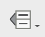
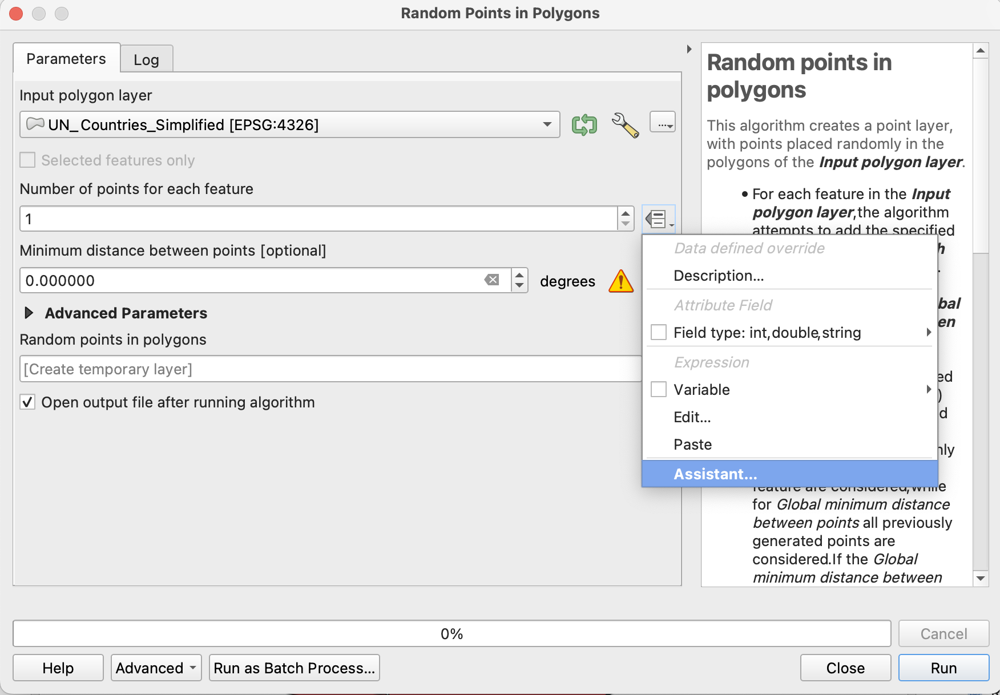
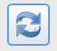
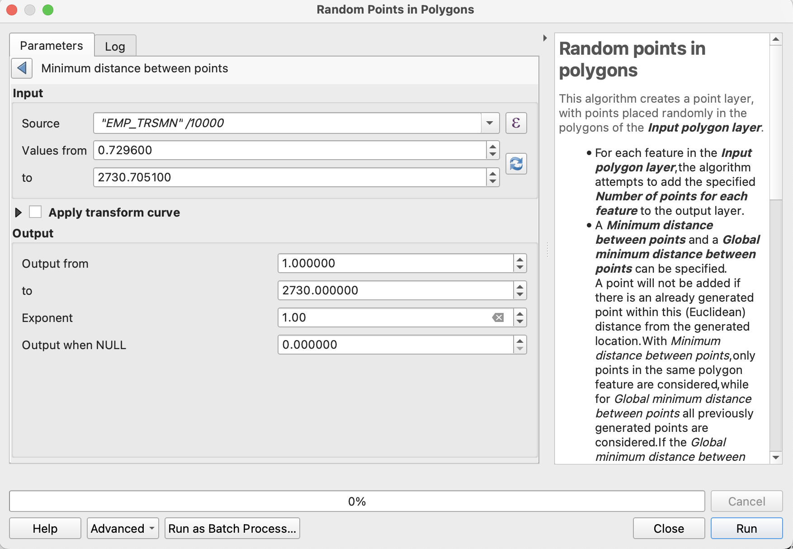

# Dot Density Tutorial: 3 - Create Dot Layer

### Summary
In __Tutorial 3__ you will convert your data into a dot density layer.

### Random Points In Polygons
Open the QGIS toolbox, and search for "Random Points In Polygons". We will use this tool to create our dot density layer. 

Once open, select "UN_Countries_Simplified" as the __input layer__.

Next, we need to specify how many dots are going to be created for each feature using the ST_EMP_TRSMN as a base. For "Number of points for each feature", select __settings__ (), then select "Assistant". 

###### Figure 3.1: Selecting the assitant to specify a data-driven value for "Number of points for each feature".

With the assistant open, we're going to use a formula to calculate how many dots should appear for each feature. Dot density maps commonly aggregate data so as to not include a 1:1 ratio of data values to dots. In our case, we're going to aggregate the data so that 1 dot equals 10,000 people. 

To this, open the __formula wizard__ (())

For the formula, include `"EMP_TRSMN"/10000` (make sure you include the double-quotes around "EMP_TRSMN"). This fomula will divide the total amount of people by 10000 for each nation. Selecting "OK" will return you to the assistant menu.

Next select the "Fetch Value Range" button (). This will fill in the upper and lower bounds of the data, which should be from 0.72 to 2730.7. 

Next, copy the upper bound (2730.7) to the "Output to" box. This will specify that we will be creating one dot per 10,000.

###### Assistant view of the "Random Points in Polygon" tool with correct parameters selected.

Select "Run".

###### Output of the "Random Points in Polygon" operation.

Note, you may have to reduce the size of points so the map is not overly crowded.

### Missing Data
Before we export, return to "UN_Countries_Simplified" shapefile and adjust the symbology. Depict  countries with no data as gray, and countries with data as white.

###### Map with no data values depicted differently than countries with data.

There are a lot of no data values! While this can dilute a visual story, the presence of missing data is also part of the story. If you find yourself with a dataset missing a lot of values, why might that be? 

### Conclusion
At this point, your map is ready for export!