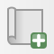
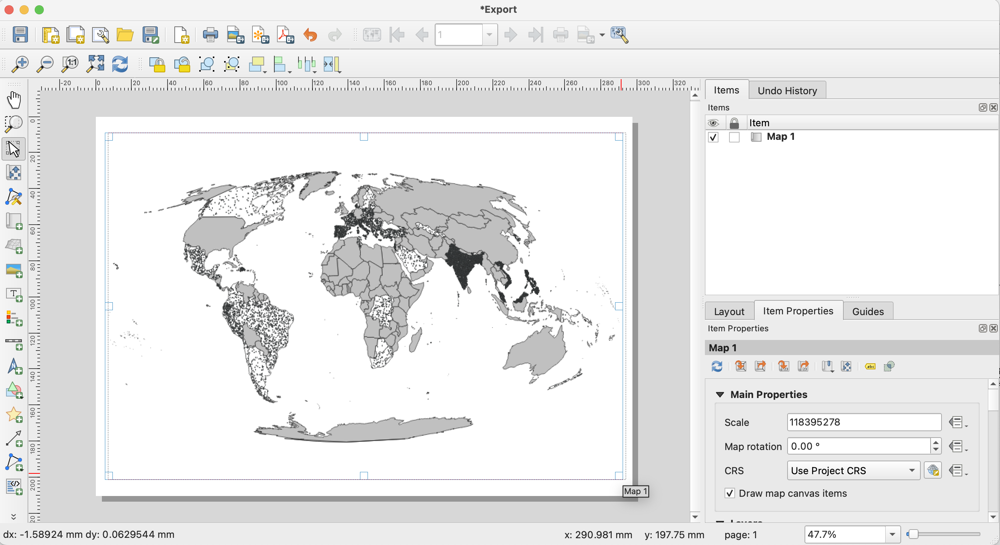
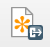
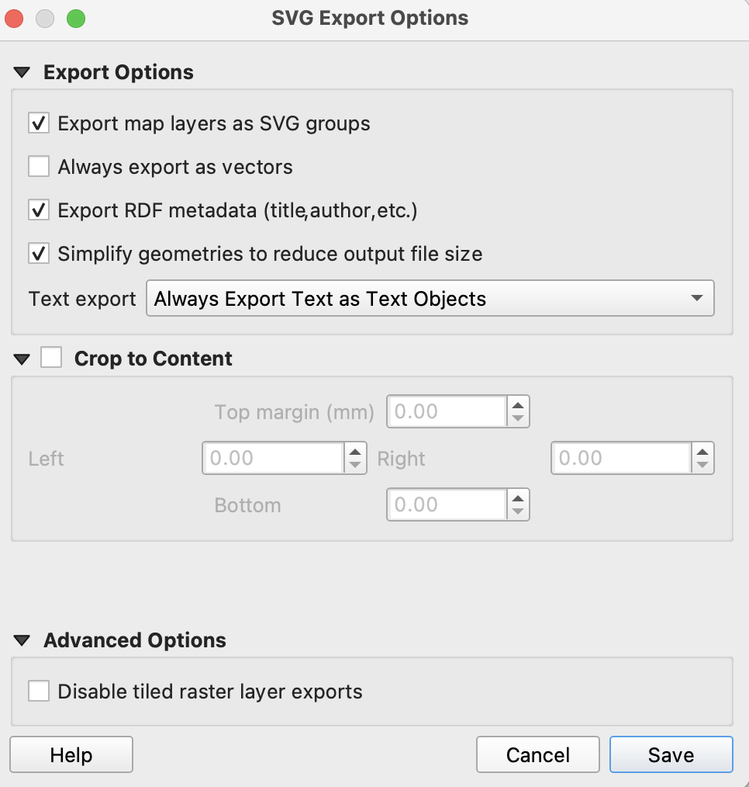

# QGIS to Illustrator Tutorial: 1 - Create and Export QGIS Layout

### Tutorial Summary
In __Tutorial 1__ you will create a layout based on a QGIS map file, and export that layout to an SVG. We will be using the example created in the [dot density](../Dot_Density/3_creating_dot_layer.md) tutorial, but you can apply this tutorial to any QGIS map file.

### Creating Layout

Begin by creating a new layout by selecting Project > New Print Layout. This will open a window which allows you to name your print layout. Name the layout "Export" and select "OK".

This will open the layout view.

###### Figure 1.1: The default QGIS layout view.

A4 should be the default QGIS layout page size, but if it seems like your layout is a different size, you can adjust it.

Select the blank page, then open the "Item Properties" tab. When open, select "A4" as the size, and "Landscape" as the orientation.

###### Figure 1.2: Layout view with item properties selected.

Next, select the "Add Map" Button (). This will turn the cursor into a plus sign, and allow you to populate your layout with the map. Drag your cursor across the blank page to add your map. You can resize the map frame if needed.

###### Figure 1.3: Layout view map frame added.

At this point, you are welcome to add any other map features to your layout (i.e. legend, north arrow, scale bar), though you can also add these items when we move to Illustrator.

### Exporting SVG

With the layout prepared, we are ready to export to Illustrator. SVG (Scalable Vector Graphic) is the most flexible vector graphic format, and can be used across a variety of vector editing software, including Illustrator—but also open-source programs like Inkscape.

Select the "Export SVG" Button (). This will open up the export menu. Choose a name and a location to export.

Next, the "SVG Export Options" menu will open. Follow the parameters set in __Figure 1.4__, which are as follows:
* Check the box for "Export map layers as SVG groups"
* Uncheck the box for "Always export as vectors"
* Check the box for "Export RDF metadata (title,author,etc.)"
* Check the box for "Simplify geometries to reduce file output size"
* For "Text Export", select "Always Export Text as Text Objects"

###### Figure 1.4: SVG Export Options menu with preferred options set.

Select "Save". 

With the SVG exported, we can now open and edit it in Illustrator!
