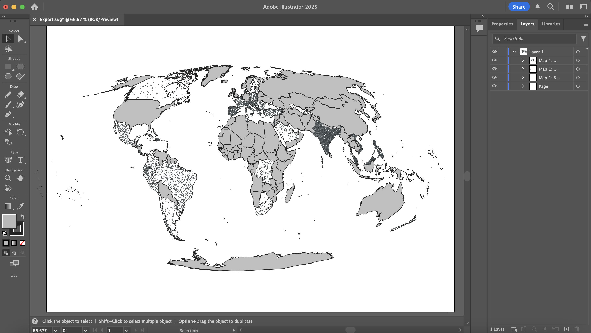
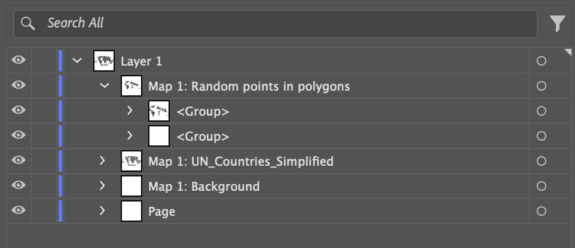
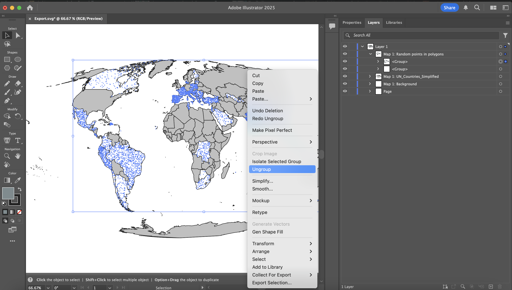
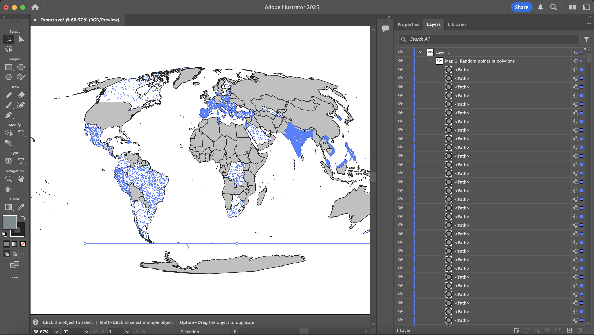
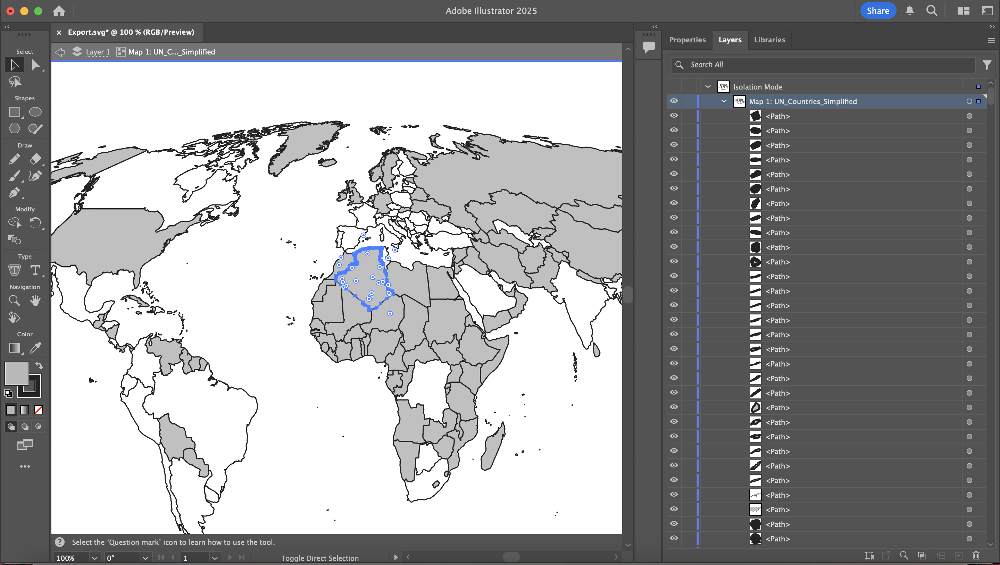
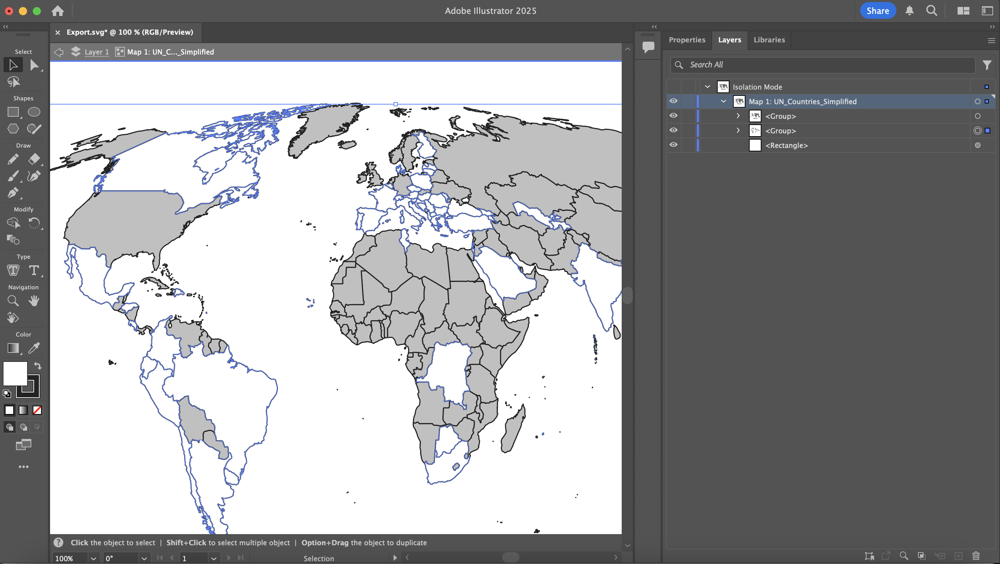

# QGIS to Illustrator Tutorial: 2 - Preparing an SVG in Illustrator

### Summary
In __Tutorial 1__ you exported an SVG file from QGIS. In __Tutorial 2__, you will open your SVG in Illustrator and do some simple preperation to make your project usable. This tutorial assumes a basic knowledge of Adobe Illustrator.

### Opening the SVG in Illustrator
Open the SVG from __Tutorial 2__ in Illustrator. While SVG is a flexible graphic format, the export from QGIS has some unnecessary layers that we'll need to clean up. 

Note: features on the edges of global projections (particularly Pacific islands), may be stretched across the map. You can delete these features when we finish setup. Alternatively, you use a different mode of representation (such as points) to represent these places. 

###### Figure 2.1: SVG opened in Illustrator.

As you can see, each of the layers from our map are represented in the layers panel on the right.

Open the topmost item in the layer panel, which should be labeled "Map 1: Random points in Polygons". This represents our dot density layer. Uncollapse the layer.

###### Figure 2.2: Layers panel with "Map 1: Random points in Polygons" uncollapsed.

As you can see, there are a number of blank `<group>` layers, as well as two `<group>` layers with content (as indicated by the white arrow to the left of the group).

Begin by selecting all of the blank `<group>` layers 

###### Figure 2.3: Layers panel with "Map 1: Random points in Polygons" uncollapsed and the blank `<group>` layers deleted.

Next select one of the remaining layers, then right click on the map.

In the result popup menu, select "Ungroup". 

###### Figure 2.4: Layers panel with a group selected and the popup menu open.

###### Figure 2.5: Results of the ungrouping.

Repeat the process for the remaining group in the "Map 1: Random points in Polygons" layer, then repeat with each other layer with items in it. Blank layers, such as "Map 1: Background" and "Page" can be fully deleted.

### Grouping Features
The next step is to group features with the same styling. For example, this map has two different styles for each country area. Countries with dot density data are white, and countries with missing data are gray. We're going to make a group for each of these two styles.

Double-click on a country on the map. This will open the layer in isolation mode. 

###### Figure 2.6: Map with the "Map 1:UN_Countries_simplified" layer in isolation mode with Algeria selected.

Next, choose "Select > Same > Fill Color". This will select all of the countries colored in gray (i.e. features with missing data).

Then, right click on the map and in the popup menu, select "Group".

Repeat this process for the countries with a white fill.

###### Figure 2.7: Map with the "Map 1:UN_Countries_simplified" layer in isolation mode with Algeria selected.

Now, will be able to more easily edit your country styling! 

At this point, your file is ready for editing.